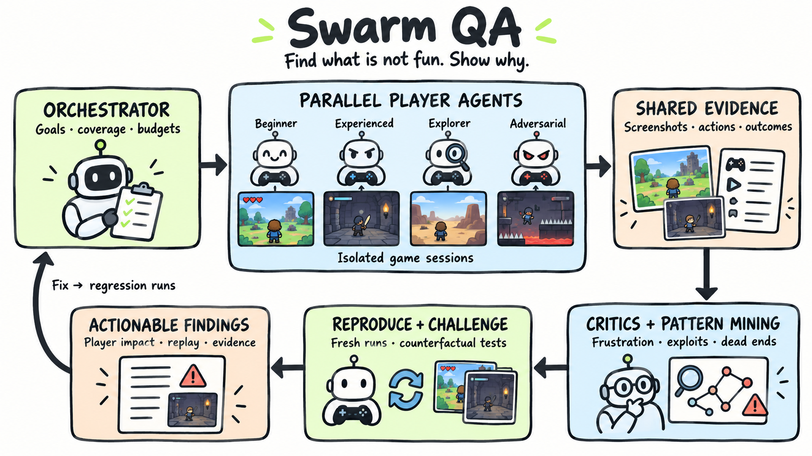
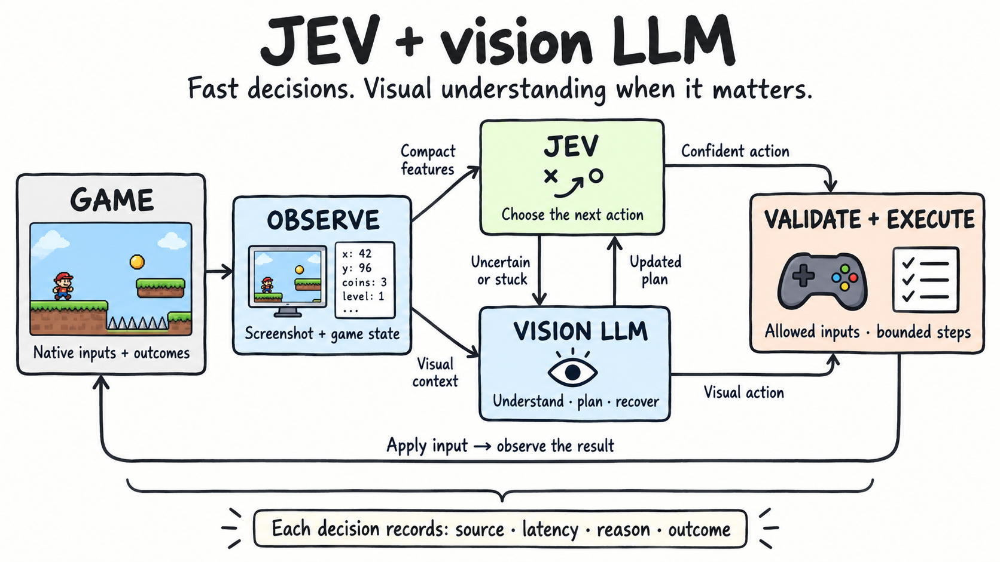

# Swarm QA

**Find what’s not fun. Show why.**

Swarm QA aims to automate game playtesting with a swarm of AI players. Agents explore a game from different perspectives, find experiences that are frustrating, confusing, repetitive or too easy to exploit, and turn those observations into reproducible evidence for the people making the game.

A beginner getting stuck, an experienced player discovering a dominant strategy, and an explorer bypassing a level reveal different design problems. Swarm QA brings those perspectives together so teams can investigate **what happened, which players it affects, and how to reproduce it**.

## The swarm



The architecture is designed around a continuous playtest loop:

1. **Coordinate coverage.** An orchestrator assigns games, levels, player profiles and exploration goals within a time and inference budget.
2. **Play in parallel.** Beginner, experienced, explorer and adversarial agents act in isolated game sessions, each with its own observations and history.
3. **Collect evidence.** Screenshots, inputs, progress, failures and outcomes provide a common record of what each player experienced.
4. **Find patterns.** Critic agents look across runs for repeated frustration, unclear feedback, progression blockers, dominant strategies and unintended shortcuts.
5. **Challenge the finding.** Fresh runs and counterfactual tests check whether the issue repeats, which conditions matter, and whether alternative strategies avoid it.
6. **Close the loop.** Findings include player impact, supporting traces and a replayable reproduction. After a change, the same scenarios become regression tests.

“Not fun” is a hypothesis to investigate, not a single score. Repeated failure may expose a confusing mechanic; effortless success may expose a balance problem. The aim is to give designers concrete evidence and useful comparisons.

## JEV + a vision LLM



A gameplay agent combines two complementary forms of reasoning:

- **JEV handles routine decisions.** Compact, structured features describe the current situation and available actions. JEV chooses the next move without needing an image on every step.
- **The vision LLM understands the screen.** Screenshots and game state support planning, visual targeting, unfamiliar situations and recovery when the agent is uncertain or stuck.
- **The executor validates and applies inputs.** Allowed keys, pointer actions and bounded simulation steps connect model decisions to the native game. The resulting state feeds the next decision.

This division aims to keep the frequent action loop responsive while reserving visual reasoning for decisions that need it. A vision-only mode provides a useful comparison. Decision logs show the source, latency, reason and observed result; visual decisions can also expose the submitted screenshot.

## Run locally

Requires Node.js 22+, `curl`, and Chrome or Playwright Chromium.

```sh
npm ci
npm run extract:all
cp .env.example .env
# Configure model credentials in .env, then:
npm start
```

Open [localhost:4173](http://localhost:4173/). Game workspaces are available for [Football Legends](http://localhost:4173/football-legends) and [OvO](http://localhost:4173/ovo). Each workspace brings together gameplay exploration, player profiles and inspectable findings.

If Chrome is unavailable, install Chromium with `npx playwright install chromium`. Set `BROWSER_EXECUTABLE` to use another Chromium binary.

### Models and credentials

One model setting applies to every game:

```dotenv
GAMEPLAY_LLM_MODEL=chatgpt-gpt-6-luna-fast
OPENROUTER_API_KEY=your-openrouter-key
```

JEV uses the OpenRouter key. The visual model runs through [@ljoukov/llm](https://github.com/ljoukov/llm), which supports an existing local Codex login for the default ChatGPT model. To use an OpenAI API model instead, select `GAMEPLAY_LLM_MODEL=gpt-6-luna-fast` and set `OPENAI_API_KEY`.

For a hosted ChatGPT model, configure the authenticated cloud proxy:

```dotenv
CHATGPT_CODEX_PROXY_URL=https://your-proxy-endpoint
CHATGPT_CODEX_PROXY_API_KEY=your-proxy-key
CHATGPT_RESPONSES_WEBSOCKET_MODE=off
```

Keep credentials in the ignored `.env` locally or in the hosting provider’s server environment. Model calls run server-side.

## Develop and verify

With the local server running:

```sh
npm run verify             # Native game integration and controller checks
npm run verify:explore     # Player profiles, decision modes and inspection UI
npm run verify:hybrid      # JEV routing and visual escalation
npm run verify:credits     # Visual targeting and native progression checks
```

Browser checks cover native input handling, explicit game-time stepping, screenshots, cancellation, reports and trace cleanup. Provider fixtures keep regression checks separate from live inference; the `agent:*` and `benchmark:*` scripts make real model calls.

The browser adapter exposes `window.gameAgent`:

```js
const state = gameAgent.observe();
const screenshot = gameAgent.capture();
const next = await gameAgent.act({
  keys: ['ArrowRight'],
  frames: 20,
  holdFrames: 3,
});
```

`observe()` reads native state, `capture()` returns the rendered screen, and `act()` applies inputs for a bounded number of frames. Game time advances explicitly, making the link between an action and its outcome inspectable. New game adapters should preserve this observation–action contract.

Run records and generated evidence stay in ignored `private/` and `evidence/` directories. Prompt, response and screenshot inspection details are temporary and cleared when the viewer exits or starts a new run.

## Game assets and attribution

The repository contains the harness, adapters, acquisition scripts and checks. `npm run extract:all` downloads the supported game builds into ignored local storage.

The MIT license covers the original harness code. Football Legends belongs to MADPUFFERS; OvO belongs to DEDRA GAMES. Original game assets and their ownership remain with their creators.
